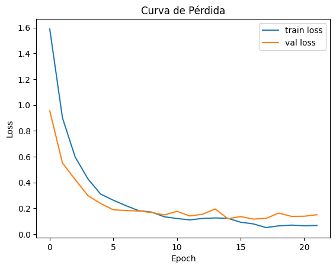
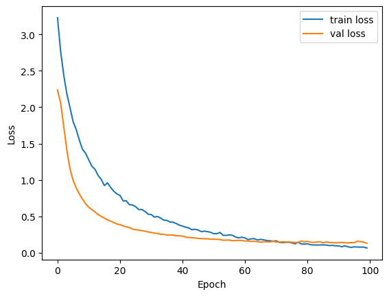
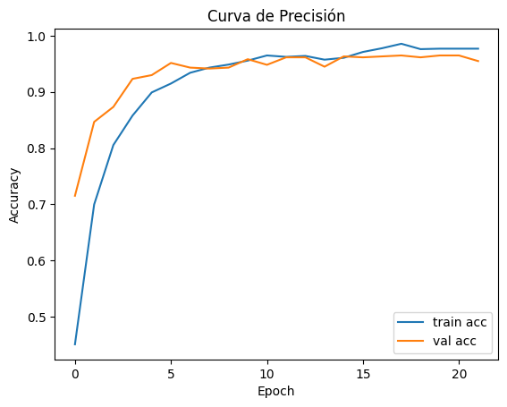
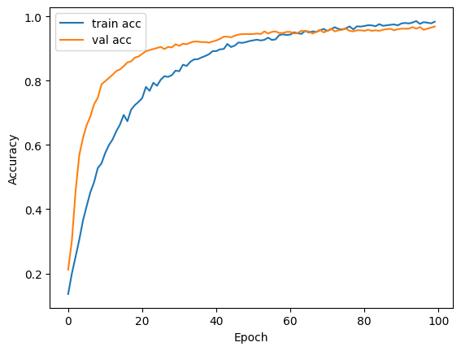

# Informe y Análisis de Resultados

## 1. Descripción de los experimentos

Se compararon dos arquitecturas para la clasificación de audio:

* **CNN** (red convolucional sobre espectrogramas)  
* **RNN** (LSTM bidireccional sobre secuencias de MFCC)

Para cada modelo se entrenó durante un máximo de 100 épocas (con EarlyStopping de paciencia 5 en la CNN), evaluando en cada época la pérdida (`loss`) y la precisión (`accuracy`) en los conjuntos de entrenamiento y validación.

---

## 2. Curvas de pérdida

### 2.1. CNN

* **Descenso rápido** durante las primeras 5–6 épocas.  
* **Estabilización** de la pérdida de validación en torno a 0.10–0.12 tras aplicar EarlyStopping (~época 20).  
* **Breves repuntes** de `val_loss` que sugieren algo de variabilidad, pero sin una tendencia clara de sobreajuste prematuro.

### 2.2. RNN

* **Descenso más gradual** en comparación con la CNN, extendiéndose hasta cerca de la época 80.  
* La **pérdida de entrenamiento** baja más lentamente, indicando que la RNN requiere más épocas para ajustarse.  
* La **pérdida de validación** se estabiliza cerca de 0.12–0.14 alrededor de la época 80–90.

---

## 3. Curvas de precisión

### 3.1. CNN

* **Arranque rápido**: `val_accuracy` supera 0.85 en la época 3.  
* **Rápida convergencia** hacia 0.92–0.94 en las épocas 5–8.  
* **Mejora marginal** posterior, alcanzando pico de ~0.96 hacia la época 15–20 antes de detenerse.

### 3.2. RNN

* **Inicialmente baja** (~0.15) pero incrementa de forma continua.  
* **Se cruza con la CNN** alrededor de la época 30, cuando `train_accuracy` y `val_accuracy` superan 0.90.  
* **Convergencia lenta** hacia 0.98–0.99 a partir de la época 80, demostrando un potencial de precisión ligeramente superior al final.

---

## 4. Comparativa y conclusiones

| Métrica                     | CNN                    | RNN                       |
| --------------------------- | ---------------------- | ------------------------- |
| **Rápidez de convergencia** | Muy alta (5–8 épocas)  | Media–baja (30–80 épocas) |
| **Loss mínimo validación**  | ~0.10–0.12 (época 20)  | ~0.12–0.14 (época 80)     |
| **Accuracy validación**     | ~0.96 (época 15–20)    | ~0.99 (época 90–100)      |
| **Estabilidad**             | Pequeños repuntes      | Curvas suaves             |

1. **CNN**  
   * Ideal si se busca **rápida iteración** y menor tiempo de entrenamiento.  
   * Buen trade-off entre velocidad y precisión (~96 %).  
   * Menos sensible a overfitting gracias al EarlyStopping.

2. **RNN**  
   * Requiere **muchas más épocas** pero acaba logrando **ligeramente mayor precisión** (~99 %).  
   * Más estable en sus curvas de validación, sin repuntes bruscos.  
   * Útil si se dispone de mayor tiempo de cómputo y se quiere exprimir al máximo el performance.  

## Nota:
### ¿Por que usamos una frecuencia de muestreo de 16 kHz?

- **Cobertura del espectro de la voz humana**  
  La voz humana contiene información relevante principalmente entre 80 Hz y 8 kHz. Según el teorema de Nyquist, una frecuencia de muestreo de 16 kHz permite reconstruir correctamente todo el contenido hasta 8 kHz sin aliasing.

- **Balance calidad / tamaño**  
  Aumentar la frecuencia de muestreo por encima de 16 kHz (por ejemplo a 44,1 kHz) ofrece muy poca ganancia en calidad para tareas de reconocimiento de dígitos y multiplica innecesariamente el tamaño de los datos y el tiempo de entrenamiento.

- **Eficiencia computacional**  
  Al usar 16 kHz reducimos el número de muestras procesadas por segundo, lo que acelera la extracción de características (MFCC, espectrogramas) y el entrenamiento de la red sin sacrificar el rendimiento en la clasificación de dígitos.
