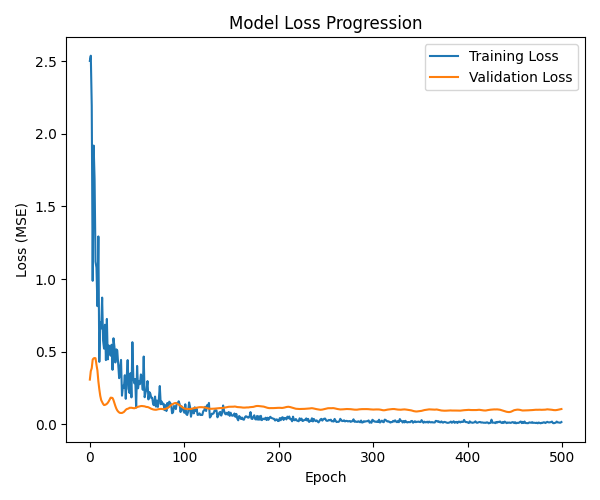
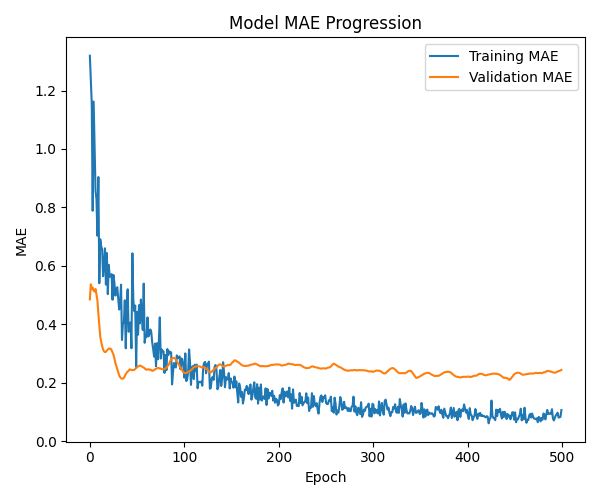

# Conclusiones

## QAgent

### 1. Ingeniería de Características
- **Variables seleccionadas**  
  - **Posición del pájaro**: discretizada en 4 estados según su altura relativa al gap, reduciendo el espacio de estados y acelerando la convergencia.  
    1. Por encima del tubo superior (0)  
    2. Entre tubos, más cerca del tubo superior (2)  
    3. Entre tubos, más cerca del tubo inferior (3)  
    4. Por debajo del tubo inferior (1)  
  - **Velocidad vertical**: discretizada en 5 categorías para capturar la dinámica de ascenso y descenso.  
    - Muy rápido descendiendo (-2)  
    - Rápido descendiendo (-1)  
    - Estable (0)  
    - Rápido ascendiendo (1)  
    - Muy rápido ascendiendo (2)  
- **Descartes de features**  
  - Se evaluó la distancia horizontal al tubo, pero no mejoró la puntuación y sí aumentó el tiempo de entrenamiento, por lo que se eliminó.

### 2. Rendimiento QAgent
- **Eficacia y velocidad**: entrenamiento rápido y balanceado; el agente supera tubos tras pocas iteraciones.  
- **Comportamiento**: ligera oscilación dentro del gap, reflejo de su estrategia para mantenerse centrado.

---

## Red neuronal

### 1. Arquitectura del modelo
- **Profundidad**: 9 capas que combinan unidades densas, normalización y dropout.  
- **Componentes clave**:  
  - Capas de normalización para estabilizar y acelerar el aprendizaje.  
  - Dropout para prevenir sobreajuste.  
- **Selección de complejidad**: se probó una versión menos profunda (MAE ≈ 0.2 en validación), pero la arquitectura de 9 capas ofreció el mejor resultado global.

### 2. Rendimiento NN
- **Comparación con QAgent**: puntuaciones similares; vuelo más suave sin oscilaciones.  
- **Métricas visuales**:

  

---

## Comparación y conclusiones finales

| Característica             | QAgent                      | Red neuronal           |
| -------------------------- | --------------------------- | ---------------------- |
| **Tiempo de entrenamiento**| Muy rápido (< 30 min)       | Moderado (~1 h)        |
| **Simplicidad**            | Alta                        | Media                  |
| **Estabilidad de vuelo**   | Oscilaciones leves          | Vuelo muy suave        |
| **Rendimiento**            | Efectivo para superar tubos | Equivalente al QAgent  |

**Recomendación**  
- **QAgent**: despliegue rápido y sencillo, aceptando la oscilación como parte del comportamiento.  
- **Red neuronal**: experiencia visual más fluida, con mayor tiempo de cómputo.
